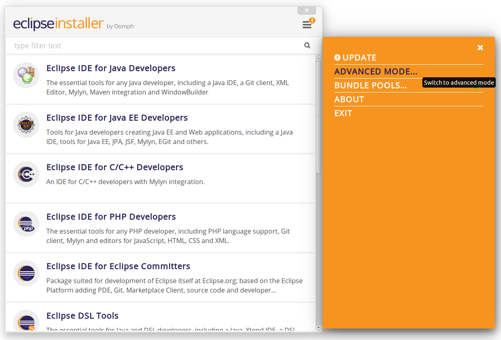
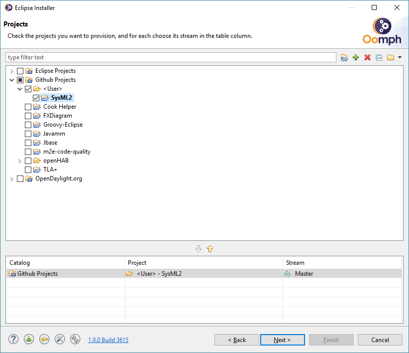
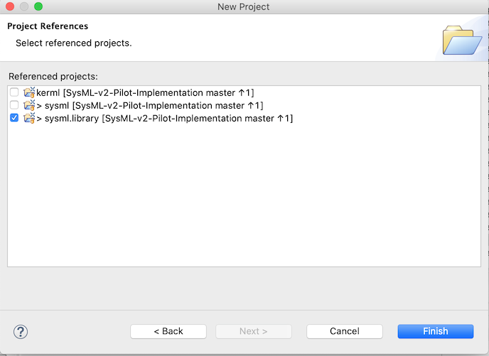

= SysML v2 Pilot Implementation Protoyping

This software is licensed under the GNU Lesser General Public License. See the files LICENSE and LICENSE-GPL.

== Installation Instructions

=== Development Environment

==== Install using Oomph Installer

The project provides a configuration file for the https://wiki.eclipse.org/Eclipse_Installer[Eclipse Installer] which eases the creation of reproducible development environments. 

1. Download the Eclipse Installer from https://www.eclipse.org/downloads/packages/installer.

2. Clone our GitHub repository from the URL below.
   * `https://github.com/Systems-Modeling/SySML-v2-Pilot-Implementation.git`
   
3. Open Eclipse Installer and switch to Advanced mode:
+

4. In the product list, select "Eclipse Modeling Tools" with Product Version: 2021-03.

5. In the Projects window, to the right of the text box, click the "+" to the add the Sysml2 project as user project. In the dialog, choose Catalog: Github Projects and browse the file system to select the setup file from the local git repository.
   * e.g. `file:/C:/git/sysml/SysML-v2-Pilot-Implementation/org.omg.sysml.installer/SysML2.setup`
   * **Note:** If you have installed the SysML v2 Pilot Implementation previously, this may already be pre-selected.

6. Select SysML2 in the Projects list:
+

7. On the next page, update the following variables, then press Next.
   * Git clone location rule: Select "Located in specific absolute folder location" and browse to the directory for the SysML git repository.
   * Root install folder: Change this if you wish the installation to be under a specific folder.
   * Workspace location rule: Change this if you wish to place the workspace at a specific location.
   
8. On the Confirmation page, press Finish. 

9. (Optional) For PlantUML visualization, GraphViz is needed.  Visit https://www.graphviz.org/download/ and download the appropriate package for your environment.
   * In the menu of Window->Preferences->PlantUML in Eclipse environment, you may set up the path to GraphViz executable if Eclipse cannot automatically find it.  For detail, visit https://plantuml.com/en/eclipse

==== Manual installation

1. Install Eclipse 2021-03 (4.19) and Xtext.
   * Install the “Eclipse Modeling Tools” package.
      * https://www.eclipse.org/downloads/packages/release/2021-03/r/eclipse-modeling-tools
      
   * To install Xtext, select Help > Install New Software, use the update site URL given below, and install “Xtext Complete SDK” (under General Purpose Tools).
      * http://download.eclipse.org/releases/2021-03

   * (Optional) For PlantUML visualization, you need to install PlantUML-Eclipse with SysMLv2 extensions from
     the update site of `https://github.com/himi/p2-update-puml-sysmlv2/raw/main/updates` with Help > Install New Software.

2. Clone our GitHub repository from the URL below.
   * https://github.com/Systems-Modeling/SySML-v2-Pilot-Implementation.git

3. Import projects from the repository into your Eclipse workspace. This should include at least the projects:
   * `org.omg.sysml`
   * `org.kerml.xtext`
   * `org.kerml.xtext.ide`
   * `org.kerml.xtext.ui`
   * `org.sysml.xtext`
   * `org.sysml.xtext.ide`
   * `org.sysml.xtext.ui`

**Note:** 
   * https://gradle.org/[Gradle] is used to build project `org.omg.sysml.jupyter`.
   * https://maven.apache.org/[Maven] is used to build the SysML Interactive JAR file that is used by `org.omg.sysml.jupyter`. 
        * To build the JAR, invoke `mvn clean package` from the base `SysML-v2-Pilot-Implementation` directory. The JAR is packaged in the `org.omg.sysml.interactive/target` directory (which is not saved to the repository).
        * If you have https://www.eclipse.org/m2e/[M2Eclipse] installed (with the Tycho Project Configurators connector), it can also be built using the launch configuration in `SysML-v2-Pilot-Implementation/launch`.

=== Prototype SysML Implementation

==== Getting Started
1. Find the file `org.omg.kerml.xtext.expressions/src/org.omg.kerml.xtext.expressions/KerMLExpressions.xtext`, right click on it, and select Run As > Generate Xtext Artifacts, to execute the Xtext generator. Repeat with `org.omg.kerml.xtext/src/org.omg.kerml.xtext/KerML.xtext` and `org.omg.sysml.xtext/src/org.omg.sysml.xtext/SysML.xtext`.

2. Once the generation is complete, right click on project `org.omg.sysml`, and select Run As > Eclipse Application. This should launch a new runtime Eclipse instance.

3. Add the SysML-v2-Pilot-Implementation Git repository (already cloned previously) to the runtime Eclipse instance.

4. Turn off Project > Build Automatically.

5. Import the projects `kerml`, `sysml` and `sysml.library` into the runtime Eclipse workspace. (See the following section if you wish to create additional projects.)

6. Execute Project > Clean with the following settings:
   * Clean all projects: *Not* selected
   * `sysml.library`: Selected
   * Start a build immediately: Selected
   * Build only the selected projects: Selected

7. Repeat Project > Clean as above for `kerml` and `sysml`.

   **Important:** Be sure to first build *only* `sysml.library` before building `kerml` or `sysml`.

8. Double clicking on any `.kerml` or `.sysml` file will open it in the generated Xtext KerML or SysML editor.
9. (Optional) To show SysML diagrams, in Window->Show View->Other... menu, you can enable PlantUML view.

==== Initializing New SysML Model Projects

1. Open the New project wizard by selecting File > New > Project... menu item.

2. Select General/Project.

3. Give the project its expected name (and location if necessary), then press Next.

4. On the Project References page, check the `sysml.library` project. This step tells Eclipse which other projects should be visible for resolving cross-references.
+

5. Right-click the new project and select Configure > Convert to an Xtext project. This step sets up the indexing infrastructure necessary for resolving references between different files.

6. Create any text files with `.kerml` or `.sysml` extensions to start working with a new file.  

** Note:** Adding the project references to an existing project can be done in the project Properties dialog available from the popup menu on the project in the Project References page.

** Note:** If the Xtext setup (step 5) is missing, opening the KerML or SysML editor shows a dialog asking to convert the project to an Xtext project. Accepting this has the same results as manually selecting the menu item on the project. 

== Copyright License Header

=== For new code
Set up a Java code template as follows:

1. Window > Preferences (Mac-OS: Eclipse > Preferences)

2. Java > Code Style > Code Templates

3. Code > New Java files > Edit

4. **Prepend** (insert above the existing content) the following and modify the second line:

+
[source,java]
----
/**
 * SysML 2 Pilot Implementation
 * Copyright (C) 2020  California Institute of Technology ("Caltech")
 *
 * This program is free software: you can redistribute it and/or modify
 * it under the terms of the GNU Lesser General Public License as published by
 * the Free Software Foundation, either version 3 of the License, or
 * (at your option) any later version.
 *
 * This program is distributed in the hope that it will be useful,
 * but WITHOUT ANY WARRANTY; without even the implied warranty of
 * MERCHANTABILITY or FITNESS FOR A PARTICULAR PURPOSE.  See the
 * GNU Lesser General Public License for more details.
 *
 * You should have received a copy of the GNU Lesser General Public License
 * along with this program.  If not, see <https://www.gnu.org/licenses/>.
 *
 * @license LGPL-3.0-or-later <http://spdx.org/licenses/LGPL-3.0-or-later>
 */
----

5. Apply > OK

=== For existing code
* When modifying existing code created by someone in a different organization, add a new copyright line, without changing anything else in the header.
* When modifying existing code for the first time in a new year, add the year as the latest year in the appropriate copy right line. (E.g., in 2021, "Copyright (C) 2020" becomes "Copyright (C) 2020-2021" and in 2022 it becomes "Copyright (C) 2020-2022".)

=== Sources
* https://www.gnu.org/licenses/gpl-3.0.en.html[GNU GPL v3.0 - How to Apply These Terms to Your New Programs]
* https://hakre.wordpress.com/2012/07/25/using-the-spdx-license-list-for-tagging-and-linking/[Using the SPDX License List for Tagging and Linking]
