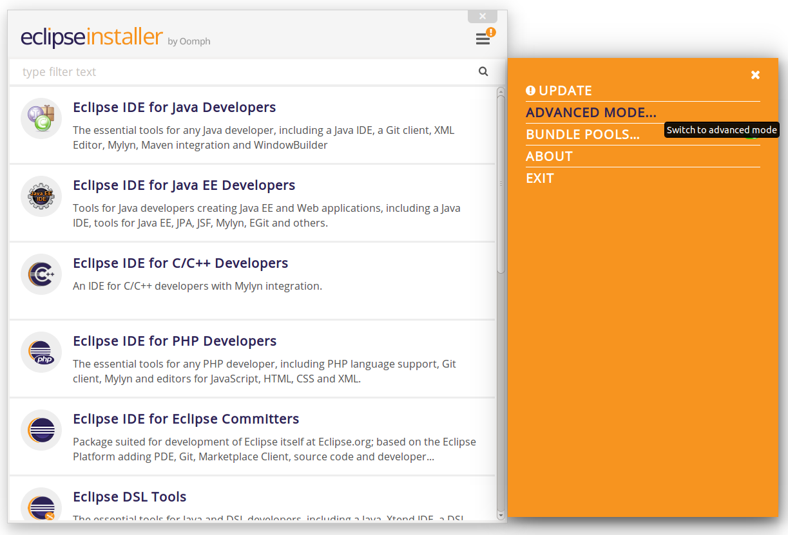
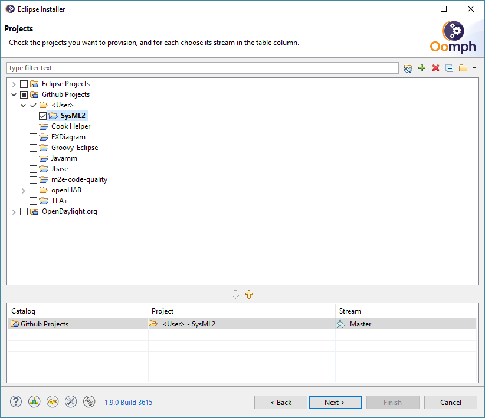
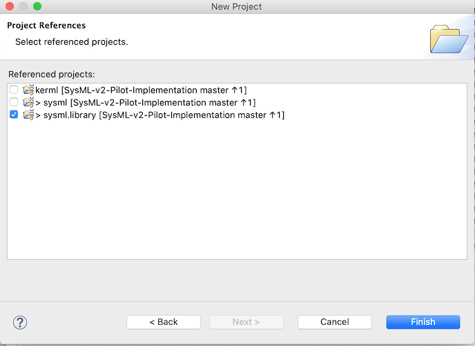

= SysML v2 Pilot Implementation Protoyping

This software is licensed under the Eclipse Public License. See the files LICENSE and LICENSE-GPL.

== Installation Instructions

=== Development Environment

==== Install using Oomph Installer

The project provides a configuration file for the https://wiki.eclipse.org/Eclipse_Installer[Eclipse Installer] which eases the creation of reproducible development environments. 

1. Download the Eclipse Installer from `https://www.eclipse.org/downloads/packages/installer`.

2. Clone our GitHub repository from the URL below.
   * `https://github.com/Systems-Modeling/SySML-v2-Pilot-Implementation.git`
   
3. Open Eclipse Installer and switch to Advanced mode:
+

4. In the Products window, select "Eclipse Modeling Tools" with:
   * Product Version: 2025-12
   * Java VM: Java 21

5. On the next page (Projects window), to the right of the text box, click the "+" to the add the Sysml2 project as user project. In the dialog, choose Catalog: Github Projects and browse the file system to select the setup file from the local git repository.
   * e.g. `file:/C:/git/sysml/SysML-v2-Pilot-Implementation/org.omg.sysml.installer/SysML2.setup`
   * **Note:** If you have installed the SysML v2 Pilot Implementation previously, this may already be pre-selected.

6. Select SysML2 in the Projects list:
+

7. On the next page, update the following variables, then press Next.
   * Installation folder name: Change this if you wish the installation to be under a specific folder.
   * Workspace folder name: Change this if you wish to place the workspace at a specific location.
   * Git clone location: Browse to the directory for the SysML git repository.
   
8. On the Confirmation page, press Finish. 

9. (Optional) For PlantUML visualization, GraphViz is needed.  Visit https://www.graphviz.org/download/ and download the appropriate package for your environment.
   * In the menu of Window > Preferences > PlantUML in Eclipse environment, you may set up the path to GraphViz executable if Eclipse cannot automatically find it.  For detail, visit https://plantuml.com/en/eclipse

*Note.* If you are going to be changing code, you should do a Maven build once the installation build completes, as described in item 5 below.

==== Manual installation

1. Install Eclipse 2025-12 (4.38).
   * Install the “Eclipse Modeling Tools” package.
     ** `https://www.eclipse.org/downloads/packages/release/2025-12/r/eclipse-modeling-tools`
      
   * Install additional release packages in Eclipse.
     ** Select Help > Install New Software.
     ** Enter the update site URL `http://download.eclipse.org/releases/2025-12`.
     ** Install “Xtext Complete SDK” (under General Purpose Tools) and "QVT Operational SDK" (under Modeling).

   * (Optional) For PlantUML visualization, install PlantUML-Eclipse with SysMLv2 extensions.
     ** Select Help > Install New Software
     ** Enter the update site URL `https://github.com/himi/p2-update-puml-sysmlv2/raw/main/updates`.
     ** Install "PlantUML Eclipse support".

2. Clone the GitHub repository from the URL below.
   * `https://github.com/Systems-Modeling/SySML-v2-Pilot-Implementation.git`

3. Import projects from the repository into your Eclipse workspace. This should include at least the projects:
   * `org.omg.kerml.expressions.xtext`
   * `org.omg.kerml.expressions.xtext.ide`
   * `org.omg.kerml.expressions.xtext.ui`
   * `org.omg.kerml.xtext`
   * `org.omg.kerml.xtext.ide`
   * `org.omg.kerml.xtext.ui`
   * `org.omg.sysml`
   * `org.omg.sysml.logic`
   * `org.omg.sysml.logic.bundle`
   * `org.omg.sysml.model`
   * `org.omg.sysml.model.bundle`
   * `org.omg.sysml.target`
   * `org.omg.sysml.xtext`
   * `org.omg.sysml.xtext.ide`
   * `org.omg.sysml.xtext.ui`

4. In the project `org.omg.sysml.target`, open `org.omg.sysml.target.target`.
   * Click the Refresh button on the right. When the refresh is complete, it should show "nnn plug-ins available" next to each URL.
   * Click "Reload Target Platform" on the upper right. 
   
5. https://maven.apache.org/[Maven] is used to perform a coordinated build of all projects.
   * To build the repository, invoke `mvn clean install` from the base `SysML-v2-Pilot-Implementation` directory.
   * If you have https://www.eclipse.org/m2e/[M2Eclipse] installed (with the Tycho Project Configurators connector), it can also launch a Maven build in Eclipse using the launch configuration in `SysML-v2-Pilot-Implementation/launch`.

=== Runtime Editing Environment

==== Getting Started
1. Right click on project `org.omg.sysml`, and select Run As > Eclipse Application. This should launch a new runtime Eclipse instance.

3. Add the SysML-v2-Pilot-Implementation Git repository (already cloned previously) to the runtime Eclipse instance.

4. Turn off Project > Build Automatically.

5. Import the projects `kerml`, `sysml` and `sysml.library` into the runtime Eclipse workspace. (See the following section if you wish to create additional projects.)

6. Execute Project > Clean with the following settings:
   * Clean all projects: _Not_ selected
   * `sysml.library`: Selected
   * Start a build immediately: Selected
   * Build only the selected projects: Selected

7. Repeat Project > Clean as above for `kerml` and `sysml`.

   * **Important:** Be sure to first build _only_ `sysml.library` before building `kerml` or `sysml`.

8. Double clicking on any `.kerml` or `.sysml` file will open it in the generated Xtext KerML or SysML editor.
9. (Optional) To show SysML diagrams, in Window > Show View > Other... menu, you can enable PlantUML view.

==== Initializing New SysML Model Projects

1. Open the New project wizard by selecting File > New > Project... menu item.

2. Select General/Project.

3. Give the project its expected name (and location if necessary), then press Next.

4. On the Project References page, check the `sysml.library` project. This step tells Eclipse which other projects should be visible for resolving cross-references.
+

5. Right-click the new project and select Configure > Convert to an Xtext project. This step sets up the indexing infrastructure necessary for resolving references between different files.

6. Create a text file with a `.kerml` or `.sysml` extension to start working with a new file.  

**Note:** Adding the project references to an existing project can be done in the project Properties dialog available from the popup menu on the project in the Project References page.

**Note:** If the Xtext setup (step 5) is missing, opening the KerML or SysML editor shows a dialog asking to convert the project to an Xtext project. Accepting this has the same results as manually selecting the menu item on the project. 

== Copyright License Header

=== For new code
Set up a Java code template as follows:

1. Window > Preferences (Mac-OS: Eclipse > Settings)

2. Java > Code Style > Code Templates

3. Code > New Java files > Edit

4. _Prepend_ (insert above the existing content) the following and modify the second line:

+
[source,java]
----
/**
 * SysML 2 Pilot Implementation
 * Copyright (C) 2026 <Your organization name>
 *
 * This program is free software: you can redistribute it and/or modify
 * it under the terms of the Eclipse Public License, version 2, as published by
 * the Eclipse Foundation.
 *
 * This program is distributed in the hope that it will be useful,
 * but WITHOUT ANY WARRANTY; without even the implied warranty of
 * MERCHANTABILITY or FITNESS FOR A PARTICULAR PURPOSE. See the
 * Eclipse Public License for more details.
 *
 * You should have received a copy of the Eclipse Public License
 * along with this program. If not, see <https://www.eclipse.org/legal/epl-2.0/>.
 *
 * @license EPL-2.0 <http://spdx.org/licenses/EPL-2.0>
 */
----

5. Apply > OK

=== For existing code
* When modifying existing code created by someone in a different organization, add a new copyright line, without changing anything else in the header.
* When modifying existing code for the first time in a new year, add the year as the latest year in the appropriate copy right line. (E.g., in 2026, "Copyright (C) 2024" becomes "Copyright (C) 2024-2026" and in 2027 it becomes "Copyright (C) 2024-2027".)

=== Sources
* https://www.eclipse.org/legal/epl-2.0/faq/[Eclipse Public License (EPL) Frequently Asked Questions]
* https://hakre.wordpress.com/2012/07/25/using-the-spdx-license-list-for-tagging-and-linking/[Using the SPDX License List for Tagging and Linking]
