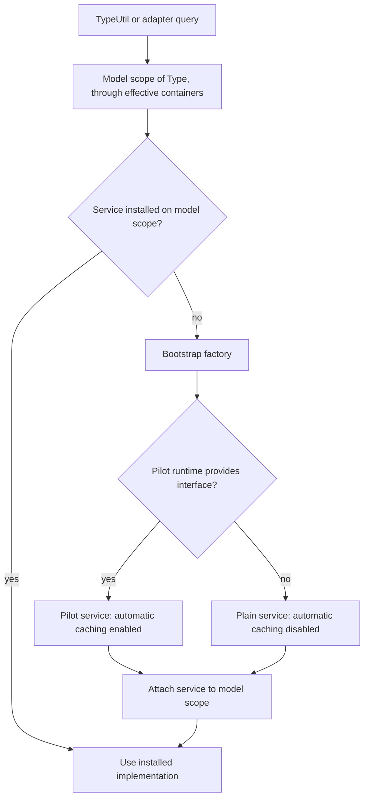
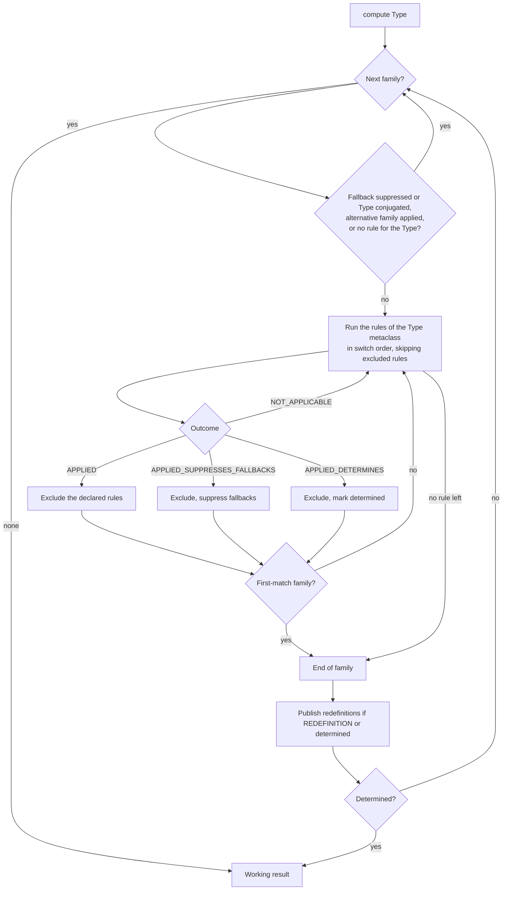
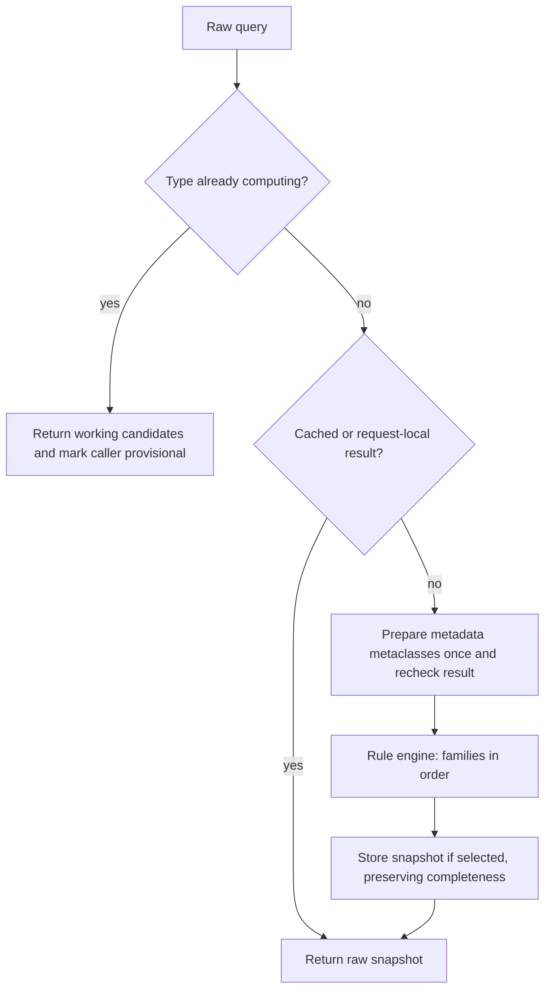
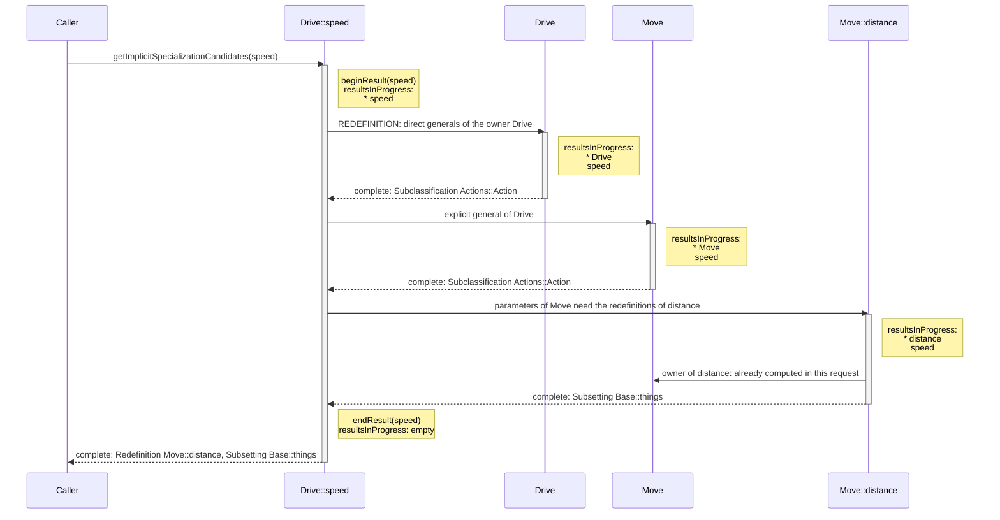
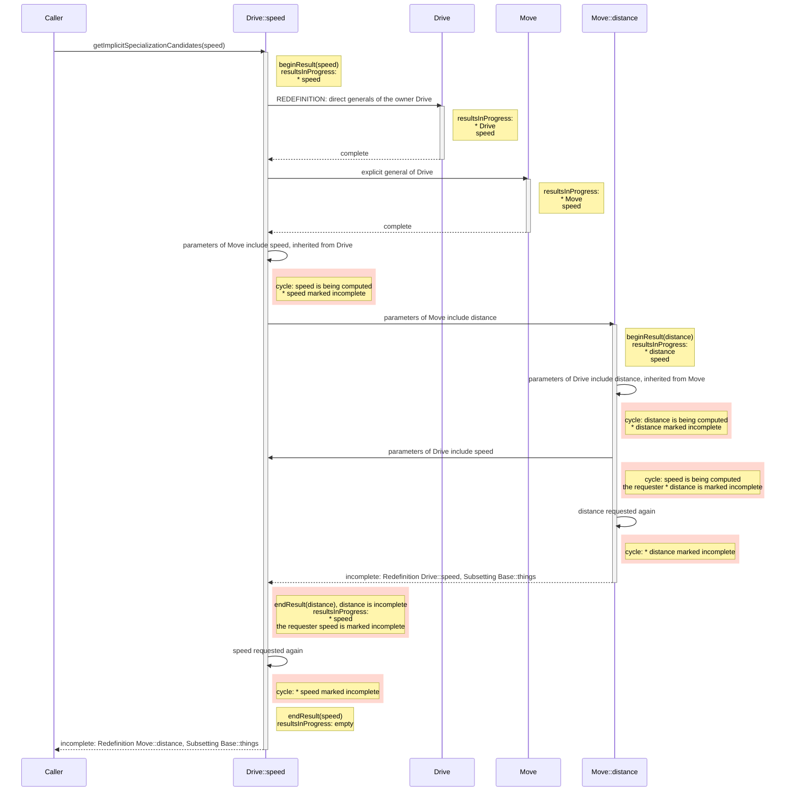
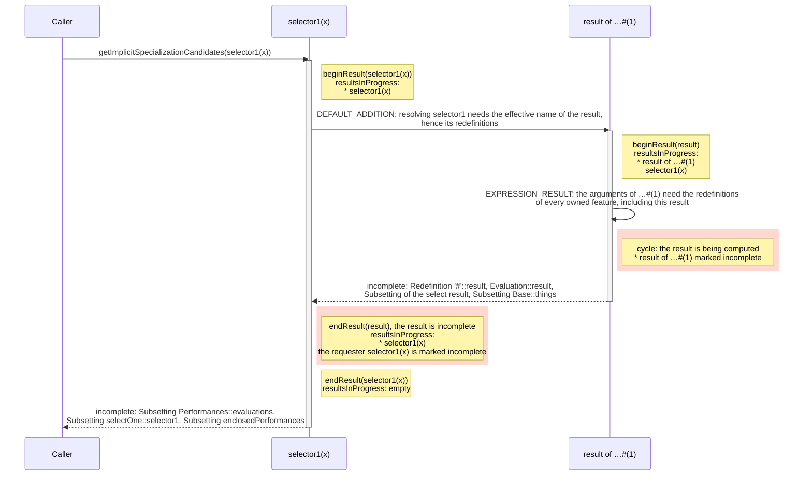
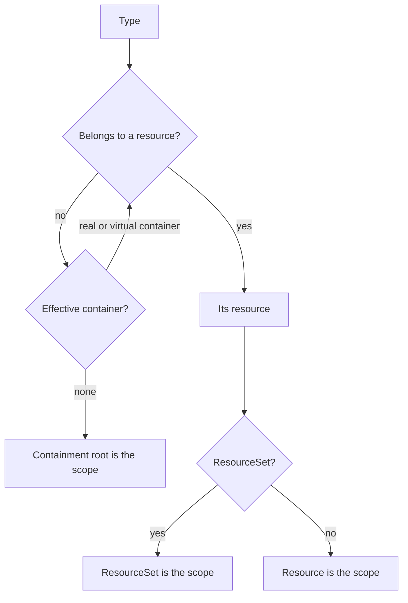
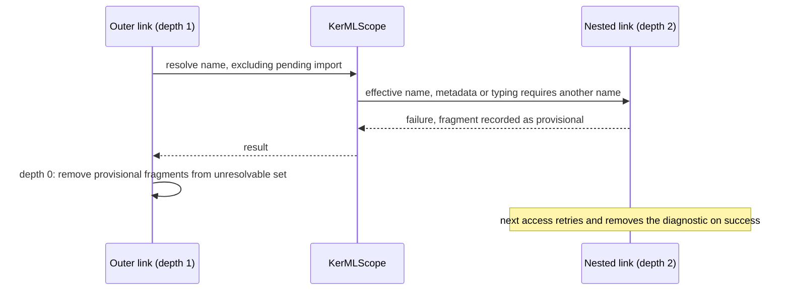

# Implicit specialization

This document describes the current handwritten logic implementation. Implicit
specializations are semantic relationships inferred from the metaclass, context,
explicit relationships and semantic metadata of a Type. They are available before
the Pilot transformation and need not be inserted into the EMF model.

## Responsibilities

The implementation is in the package `org.omg.sysml.logic.implicit.specialization`, and its
public contracts in `org.omg.sysml.logic.implicit.specialization.api`. The rules, their
catalog, the engine and the helpers shared by the rules are in
`org.omg.sysml.logic.implicit.specialization.rules`, where most they stay package-private.

| Component                                                                      | Responsibility                                                                                                                                                   |
| ------------------------------------------------------------------------------ | ---------------------------------------------------------------------------------------------------------------------------------------------------------------- |
| `IImplicitSpecializationService`                                               | Injectable contract for raw and reduced implicit-specialization queries                                                                                          |
| `ImplicitSpecializationService`                                                | Default implementation; automatic cache installation is disabled unless explicitly configured                                                                    |
| `ImplicitSpecializationServices`                                               | Connects TypeUtil and adapters to the service installed on their ResourceSet                                                                                     |
| `PilotImplicitSpecializationService`                                           | Pilot runtime binding that explicitly enables automatic caching for all Types that reach the model                                                               |
| `ImplicitSpecializationRules`                                                  | Rule engine: registers, orders and runs the rules of each family (see "Computation order")                                                                       |
| `ImplicitSpecializationRule`                                                   | One rule: identifier, family, subject metaclass, exclusions and body given as a lambda, declared with `self`, `defaultKey` and `excluding`                       |
| `ImplicitSpecializationRuleFamily`                                             | Ordered rule families and their properties (fallback, first match, redefinition publication, alternative)                                                        |
| `ImplicitSpecializationRuleCatalog`                                            | Registration of every rule class                                                                                                                                 |
| `ImplicitSpecializationFamilyRules` / `ImplicitSpecializationRulesByMetaclass` | The rules of one family, indexed by the metaclass of their subject in switch order                                                                               |
| `ImplicitSpecializationRuleRun`                                                | State of one computation: the Type, its working result, the applied families, the excluded rules and whether the Type is determined                              |
| `KerML*Rules` / `SysML*Rules`                                                  | The rules of one specification clause, each named after the constraint it implements                                                                             |
| `ImplicitTypingPredicate` / `SpecializationHelper` / `PositionalRedefinitions` | Structural-typing predicates, map/library-lookup helpers and positional matching shared by several rules                                                         |
| `ImplicitSpecializationEvaluationContext`                                      | Temporary working results and recursion tracking                                                                                                                 |
| `IImplicitSpecializationCache`                                                 | Interface for a Type's optional raw and reduced snapshots and their completeness; `DefaultImplicitSpecializationCache` is the default EMF-adapter implementation |
| `ImplicitSpecializationCacheUtil`                                              | Installation and invalidation, independent of any query service — the entry point for a downstream application to manage caches directly                         |
| `ImplicitSpecializationReducer`                                                | Filters redundant candidates on a separate working copy                                                                                                          |
| `TypeUtil.insertImplicitSpecializations`                                       | Explicit insertion of reduced relationships into the model                                                                                                       |
| `ElementAdapter` hierarchy                                                     | Other derived properties, their caches, additional members and transformation; TypeAdapter requests its reduced view at the existing transformation boundary     |

The default implementation owns rule helpers and its default installation predicate;
it has no singleton instance. ResourceSet policy overrides, Type caches and temporary
evaluation adapters belong to EMF objects. Temporary evaluation adapters are removed
in `finally`, including when a rule throws.

All operations are confined to the model's thread. Do not edit the model, replace
its service or change the policy reentrantly during a query. This is not a concurrent
cache. An application-supplied predicate must respect the same lifetime constraints.

## Service injection and Pilot configuration

```java
IImplicitSpecializationService service = new ImplicitSpecializationService();
ImplicitSpecializationServices.install(resourceSet, service);
```

Install the application-supplied implementation before semantic queries. TypeUtil,
TypeAdapter, FeatureAdapter and connector transformation obtain it through
`ImplicitSpecializationServices.get(type)`. An explicitly installed service takes
precedence over runtime lookup. Replacing a service does not invalidate existing
results: invalidate them explicitly if the new implementation changes semantics.

Without explicit installation, the first lookup creates and retains a service on
the model scope of the Type: its ResourceSet, or its resource when that resource has
no ResourceSet. A detached Type uses the scope of the model element it was created
for, and a detached tree linked to no element in a resource uses its containment root
(see "Detached Types" below). There is no static service instance shared by all
models.

The plain logic factory creates `ImplicitSpecializationService()`, whose automatic
installation policy always refuses. Pilot runtime modules explicitly bind
`IImplicitSpecializationService` to `PilotImplicitSpecializationService`, which
calls `super(type -> true)`. Both KerML and SysML textual and XMI modules install
the shared runtime factory through `configureServiceFactory()`.

This bootstrap factory is a process-wide lookup hook, analogous to the existing
library-provider lookup. On the first service lookup for a model scope, it asks the
resource's `IResourceServiceProvider` for the Guice-bound interface implementation.
If no runtime supplies one, it creates the plain uncached default. Applications
can override the Guice binding or explicitly install their own implementation on
a ResourceSet. The runtime factory is not consulted again for a scope that already
has a service. It retains no model references globally.



## Public queries

```java
IImplicitSpecializationService service = ImplicitSpecializationServices.get(type);

// Application view: candidates already covered by other specializations are omitted.
List<ImplicitSpecialization> reduced = service.getImplicitSpecializations(type);

// Semantic engine view: direct rule results, before redundancy filtering.
List<ImplicitSpecialization> raw = service.getImplicitSpecializationCandidates(type);

// Whether a computation or reduction is in progress in the model of type, that is
// whether a query made now would be reentrant.
boolean reentrant = service.isEvaluationInProgress(type);
```

Each entry contains the specialization EClass and its general Type. Lists are
immutable snapshots, ordered by metaclass classifier ID and then rule insertion
order. The referenced EMF objects remain live. An empty list is a valid result;
null Type queries return an empty list. Duplicate generals of the same kind are
removed by identity, or by the ordered chaining features for inferred feature
chains. A Type is never its own inferred direct general.

The service does not choose between these views. The unfiltered
`TypeUtil.getImplicitGeneralTypesFor(type)` query, which backs the Pilot's supertypes and
name scopes, makes the choice itself: it uses the raw candidates when
`isEvaluationInProgress(type)` is true or when the Type is not transformed, and the
reduced view otherwise. The reduced view of transformed Types preserves the Pilot's
inheritance and name-scope behavior; raw candidates during an evaluation avoid starting a
reduction inside a computation. The kind-filtered TypeUtil queries always use raw
candidates. Reduction is not called from raw computation. Downstream application can
use the reduced view directly without running the Pilot transformation.

Queries may invoke ordinary EMF derived getters, resolve proxies and create
additional members such as expression results or transition features. They do not
insert the reported specialization relationships or run a global transformation.
Thus “consultation” is not a promise that all EMF access is free of side effects.

## Computation order

Before entering the guarded semantic computation, applicable metadata metaclasses are
resolved. Their linking can itself require the annotated Type's inherited scope.
A request-local identity set ensures this preparation is entered once per Type
while allowing the necessary nested specialization query. The cache is checked
again afterward because that nested query may already have produced its result.

`ImplicitSpecializationService.compute` then delegates to the rule engine,
`ImplicitSpecializationRules`. Every rule is an `ImplicitSpecializationRule` that
declares:

- an identifier: the name of the specification constraint it implements, or a
  descriptive name when no constraint names the rule;
- a family, which fixes when the rule runs;
- a subject metaclass, matched against the Type being computed; a rule that depends on the
  owning type of a Feature is declared on `Feature` and tests `getOwningType()` in its body;
- the identifiers of the rules of the same family that it excludes once it applies;
- a body that adds candidates to the working result and returns an outcome.

The following order is within a Type, not a topological order of the entire model.
The families run in this order:

| Family               | Rules                                                                                                                               | Properties                                            |
| -------------------- | ----------------------------------------------------------------------------------------------------------------------------------- | ----------------------------------------------------- |
| `CONTEXT`            | Feature-chain targets, connector ends, flow-end features and loop variables                                                         | Some rules fully determine the Feature                |
| `PRIORITY_EXCLUSIVE` | FlowEnd subsetting, transition-trigger AcceptActionUsage, transition payload                                                        | A rule that applies suppresses the fallback families  |
| `PRIORITY`           | Variant usages, owned cross features, instantiated types of operator and trigger invocations, requirement and viewpoint memberships | Skipped when a `PRIORITY_EXCLUSIVE` rule applied      |
| `METADATA`           | Semantic metadata base types                                                                                                        | Fallback                                              |
| `REDEFINITION`       | Positional and contextual Feature redefinitions                                                                                     | The redefinitions are published after the family      |
| `EXPRESSION_RESULT`  | Reference, chain, index, select, constructor and invocation result specializations                                                  | Reads the published redefinitions                     |
| `DEFAULT_KEY`        | The default generalization of the metaclass, from `ImplicitGeneralizationMap`                                                       | Fallback; the first rule that applies ends the family |
| `DEFAULT_ADDITION`   | Additional defaults, such as subaction, subpart or participant subsettings                                                          | Fallback                                              |

A fallback family is skipped for a conjugated Type and once a rule has suppressed
the fallbacks. Rules report one of four outcomes:

| Outcome                        | Effect                                                                                                         |
| ------------------------------ | -------------------------------------------------------------------------------------------------------------- |
| `NOT_APPLICABLE`               | None; the rule must not have added anything, and the engine removes nothing                                    |
| `APPLIED`                      | The excluded rules no longer run; in a first-match family, the family ends                                     |
| `APPLIED_SUPPRESSES_FALLBACKS` | As `APPLIED`, and the fallback families are skipped                                                            |
| `APPLIED_DETERMINES`           | As `APPLIED`; the current family ends normally, the redefinitions are published and later families are skipped |

Within a family, the rules follow the order of the generated `SysMLSwitch` for the
concrete metaclass of the Type: the metaclass itself, then its
supertypes by increasing maximum depth and, at equal depth, in order of first
discovery (`ImplicitSpecializationRulesByMetaclass.switchOrder`, which reproduces the EMF
generator). A rule on a more specific metaclass therefore runs before a rule on one of
its supertypes, and rules on the same metaclass follow their registration order in
`ImplicitSpecializationRuleCatalog`. For each family, `ImplicitSpecializationFamilyRules`
holds one `ImplicitSpecializationRulesByMetaclass`, which computes the
applicable rules of every metaclass once, when the engine is created, and selects them
by the classifier ID, like the generated switch.

An exclusion takes effect only on rules that have not run yet: the excluding rule must
come first in this order, which is the case for a rule on a more specific metaclass.
For example, `checkStateUsageSubstateSpecialization` (StateUsage) excludes
`checkActionUsageSubactionSpecialization` (ActionUsage), and every rule redefining a
particular kind of Feature (payload, transition link, state action, transition feature,
guard, objective) excludes the generic `positionalFeatureRedefinition`. When it is
created, the engine checks that identifiers are unique, that each excluded rule belongs to
the same family, and that the excluding rule runs before the excluded one for every
metaclass to which both apply; an exclusion that could not take effect is refused. These
checks run once, on the built order, and cost nothing while rules run.



### Why a rule can skip every later family

KerML §8.4.2 "Semantic Constraints and Implied Relationships" requires a tool to
avoid inserting an implied Specialization that would be redundant with one already
selected for the same element, but explicitly exempts implied Redefinitions from
that filtering: "the above rules do not apply to Redefinitions implied by
redefinition constraints, because Redefinition relationships have semantics beyond
just basic Specialization." Three `CONTEXT` rules — a feature-chain source
target (§8.3.4.8.4), the first feature of a Flow's source/target FlowEnd
(§8.4.4.10.2) and a ForLoopActionUsage's loopVariable (SysML §8.3.17.9/§8.4.13.10)
— are each pinned by one narrowly-scoped, named redefinition constraint that fully
and authoritatively determines the Feature. Running later families afterward
for that same Feature would at best re-derive a redundant candidate and at worst
let a generic rule compete with a relationship the specification has already
settled, so these rules return `APPLIED_DETERMINES`. The other `CONTEXT` rule (a
connector end typed by its owned value Expression) is a genuine fallback in disguise
— it mirrors `checkFeatureValuationSpecialization`'s own "if no explicit
specialization" wording (§8.4.4.11) — so it returns `APPLIED` and never blocks later
families.

The determined state, the applied families and the excluded rules are held by an
`ImplicitSpecializationRuleRun`, created for each computation of a Type; only the
fallback suppression and the completeness, which several rules read, are
held by `ImplicitSpecializationResult`.

### Where to add a new rule

1. **Which class?** The clause of the specification that defines the constraint:
   a KerML constraint of §8.3.x goes into the `KerML<Clause>Rules` class of that
   clause, a SysML one into `SysML<Clause>Rules`. Create the class, and register it
   in `ImplicitSpecializationRuleCatalog`, when the clause has none yet.
2. **Which identifier?** The constraint name. Its Javadoc cites the section and
   quotes the normative text verbatim. A rule that no constraint names gets a
   descriptive identifier and a Javadoc explaining which part of the specification it
   supports.
3. **Which family?**
   - A Redefinition constraint belongs to `REDEFINITION`, unless it names this one
     Feature specifically and must prevent every other rule, as above: then it belongs
     to `CONTEXT` and returns `APPLIED_DETERMINES`.
   - The default generalization of a metaclass belongs to `DEFAULT_KEY`, declared with
     `defaultKey`, which only selects the key of `ImplicitGeneralizationMap`.
   - A constraint conditioned by the absence of explicit specializations, or which
     only adds a default, belongs to `DEFAULT_ADDITION`.
   - A constraint that applies whenever its structural precondition holds belongs to
     `PRIORITY`, or to `PRIORITY_EXCLUSIVE` when it fully determines the Feature and
     must suppress the fallbacks.
   - A specialization of an expression result belongs to `EXPRESSION_RESULT`, which
     runs after the redefinitions are published.
   - A constraint of the specification that concerns TypeFeaturing or binding
     connectors is outside this candidate computation: `ConnectorUtil` and
     `FeatureUtil` compute these as derived EMF accessors.
4. **Which subject?** The most specific metaclass to which the constraint applies,
   with `self`. When the precondition is a property of the owner, such as the metaclass of
   `feature.getOwningType()`, the rule is declared on `Feature` and tests the owner in its
   body.
5. **Which precedence?** When the rule replaces another rule of the same family for
   some Types, declare it with `excluding`; the engine refuses the exclusion if the new rule
   does not run first. A rule that
   reads the working result, for example `containsKind(REDEFINITION)`, must be in a
   family that runs after the rules producing what it reads.

Contextual rules are computed from the requested feature's owner. For example,
requesting an index expression's result computes its sequence-result subsetting
without requiring the expression to have been transformed first. Transition payload
position uses the second _owned_ parameter; consulting inherited memberships here
would introduce a dependency on the payload's own unfinished redefinitions.



On a cache miss, the evaluator checks active computation before starting any rules.
Completed redefinitions may be read during a later family only if that family itself
did not observe a provisional dependency. Default typing predicates inspect their
own current working candidates instead of recursively asking for their own final
result. These two distinctions avoid false cycles without concealing real ones.
Qualified library names still come from `ImplicitGeneralizationMap`.

### Worked example: nested computations and `resultsInProgress`

Computing the specializations of one Type often requires the specializations of other
Types, so computations nest. The evaluation context keeps them in a stack,
`resultsInProgress`: `beginResult` pushes the result a computation or reduction starts
building, and `endResult` pops it in a `finally` block. The top of the stack is therefore
always the result of the computation that is making the current request. When a request
observes a provisional dependency, `markRequestingResultIncomplete` marks that top
result, not the Type that was requested. When a computation ends incomplete, it marks the
next result on the stack, its own requester, and so on up the stack. A result already
computed in the same request is returned from the request-local results without pushing
anything.

**Nested computations.** Querying the raw candidates of `speed` in

```sysml
package Example {
    action def Move { in distance; }
    action def Drive :> Move { in speed; }
}
```

runs the following steps. The `positionalFeatureRedefinition` rule of the `REDEFINITION`
family must find the parameter at the same position in each
direct general of `Drive`, which needs the generals of `Drive` and `Move`; listing the
parameters of `Move` needs the redefinitions of `distance`. Each activation bar is an
entry of `resultsInProgress`.

In the notes and in the table below, `resultsInProgress` is drawn as a stack, one entry per
line, the top first. The top entry, marked `*`, belongs to the computation that is running:
it is the one that `markRequestingResultIncomplete` marks. The entries below it are
computations waiting for the one above them.



Every result ends complete, so each can be cached as complete.

**Cycle and provisional results.** While a model is being edited, the two definitions can
temporarily specialize each other:

```sysml
package Example {
    action def Move :> Drive { in distance; }
    action def Drive :> Move { in speed; }
}
```

Querying `speed` starts as above, but the parameters of each general now lead back to
`speed` and `distance` while they are still being computed. The highlighted notes are the
moments where a result is marked incomplete; each time, the marked result is the top of the
stack, not the Type that was requested.



Both results are still returned, and cached when their Type has a cache, but as
provisional results: they are not recomputed automatically (see "Cache policy and
lifecycle").

**Standard library example.** The same situation occurs in the standard library, without
any modeling error. `ControlFunctions::selectOne` (KerML library) is defined as

```kerml
function selectOne {
    in collection: Anything[0..*] ordered nonunique;
    in expr selector1[0..*] { in argument: Anything[1]; return : Boolean[1]; }
    return : Anything[0..1] = collection->select {in x; selector1(x)}#(1);
}
```

Querying the raw candidates of the invocation `selector1(x)`, before its resource is resolved,
runs the following steps:

1. The `DEFAULT_ADDITION` rule `checkInvocationExpressionSpecialization` of `selector1(x)`
   reads its instantiated type, which resolves the name `selector1`.
2. Name resolution searches the memberships of the enclosing namespaces and needs their
   member names. The result of `…#(1)` has no declared name: its effective name comes from
   the Feature it redefines, so its redefinitions are requested, which computes that result.
3. The `EXPRESSION_RESULT` family of that result applies the index rule, which reads the arguments of `…#(1)`.
   Arguments are the owned features of the expression ordered by the parameters they
   redefine, so the redefinitions of every owned feature are requested, including those of
   the result itself: a cycle.



Both results stay provisional in their caches. After resolving the whole standard library
with the Pilot cache policy, 10 library Types keep a provisional raw result: these two in
`ControlFunctions`, two in `SampledFunctions::interpolateLinear::index`, which also applies
`#(1)` to the result of a `->select`, and six features of `ShapeItems::Polygon` and
`ShapeItems::Pyramid`, which are not analyzed here.

## Semantic metadata and dependencies

For each applicable metadata feature, the implementation first resolves its
metaclass before installing the full computation guard. It obtains the metadata's
baseType feature, selects features specializing it, obtains their value expressions,
and evaluates those expressions in the
metadata feature's context. The first evaluated value is interpreted as a
metaclass reference. The annotated Type then receives the appropriate inferred
specialization or typing.

Consequently the semantic dependencies can extend beyond the annotated Type, its
container and its resource. Editing data reached through expression evaluation can
change the result without editing the annotation itself. No persistent dependency
registry or automatic propagation is installed. Cache selection must account for
these dependencies, or the application must invalidate affected Types explicitly.

Library lookup uses the normal SysMLLibraryUtil provider. `SysMLLibraryUtil` starts
from the closest element in a resource, which a detached Type reaches through its
effective containers (see "Detached Types" below); rules pass it the element for which
they need a library type.

## Detached Types

Some Types are created outside the model: feature chains used as inferred generals or
featuring types, and binding connectors with their end features. The specification has
no such elements: an implied Relationship is owned by the element being constrained,
and a feature chain it targets is owned by that Relationship. The implementation
creates them before the Relationship that will own them, because a query must not
insert relationships into the model. Until materialization, they have no container
and no resource.

When such an element is stored as the target of an implied relationship, the element
that owns the relationship is recorded with `VirtualContainer.attach` as its _virtual
container_. `ElementUtil.getEffectiveContainer` returns the real container when there
is one and the virtual container otherwise; `ElementUtil.getClosestElementInResource`
follows these effective containers up to the first element that belongs to a resource.
The link is an adapter: it is not part of the model, is not serialized and does not
notify. Only the root of a detached tree, with no container and no resource, receives
one; the first recorded container is kept.

| Stored by                                                                  | Element                                                                                                                                                                  | Virtual container                     |
| -------------------------------------------------------------------------- | ------------------------------------------------------------------------------------------------------------------------------------------------------------------------ | ------------------------------------- |
| `ImplicitSpecializationResult.add`                                         | feature chains inferred by `checkFeatureChainExpressionResultSpecialization`, the decision and merge successions, `checkFeatureValuationSpecialization`, `checkFeatureCrossingSpecialization` and `checkTransitionUsagePayloadSpecialization` | the Type being computed               |
| `TypeAdapter.createImplicitBindingConnector`                               | binding connector, whose implied relationship is its owning membership                                                                                                   | the Type being transformed            |
| `FeatureAdapter.addFeaturingType`                                          | `that.startShot` chain featuring the binding connector of an initial value                                                                                               | the binding connector                 |
| `FeatureAdapter.addFeaturingType`                                          | `<Owner>_snapshots` feature of a variable feature, cartesian product features of an owned cross feature                                                                  | the featured Feature                  |

A binding connector is linked as soon as it is created, before it is stored: choosing
the list that stores it reads its inherited ends, which computes its library general
from the connector itself. The chain of a value expression and its result, used as an
end of the value binding connector, is not a root: the reference subsetting of the
connector end owns it.

The walk up the effective containers must terminate. A model built without a resource
has roots that are not in a resource either, and such a root can be stored as the target
of an implied relationship owned by one of its own members, for example as the
featuring type of a nested feature. `attach` does not record a link when the element is
already an effective container of the proposed container, so effective containers never
form a cycle. Such a root may still receive a virtual container in another tree without
a resource; no element in a resource is reachable from it in any case.

The implementation reaches the model from a detached Type as follows:

- **Model scope.** `ImplicitSpecializationServices.scopeOf` is the ResourceSet of the
  closest element in a resource, or that resource when it has no ResourceSet. The
  service and the context of the request in progress are found there. A request on a
  detached Type made during a computation therefore shares that computation's stack
  of results in progress, and a provisional result marks the requester.
- **Library lookup.** `SysMLLibraryUtil.getLibraryElement` starts from the closest
  element in a resource of the element it is given, so a rule resolves library types
  from a detached Type as from the element it was created for.
- **Cycle guard.** The computation guard is installed on detached Types too. It
  identifies a cycle and holds the working result; it plays no part in finding the
  context or the service.
- **Caching.** A detached Type that reaches the model is cached like an attached Type,
  since its results depend only on the model. The rules do not read the featuring
  types of the Type they compute, so the cache of a binding connector, filled before
  its featuring types are added, stays valid. Until its relationship is inserted, such
  a Type is not reached by `ImplicitSpecializationCacheUtil.invalidate(resource)`, which
  walks containment: invalidating a resource while one of its Types is being
  transformed leaves these caches unchanged.
- **Materialization.** A detached Type becomes owned when its relationship is
  inserted: by the inserted Specialization or TypeFeaturing, by the connector end
  (`ConnectorUtil.addConnectorEndTo`), or by the Membership of a binding connector.
  Its real container then takes precedence; the virtual container is kept.



Known limitation: some Types without a resource have no virtual container, because
they are not targets of implied relationships. These are the metaclass feature of an
element (`ElementAdapter.getMetaclassFeature`), the elements created by expression
evaluation, and unresolved proxies. They are never cached,
and a request on one of them uses its containment root as scope. It therefore starts a
new context whose provisional results do not mark the requesting computation, and no
library type is found from it.

## Cache policy and lifecycle

By default, no cache is installed automatically. The Pilot explicitly opts into
caching all Types that reach the model through its runtime service binding: attached
Types and detached Types linked to the model (see "Detached Types"). Other Types are
request-local only, even with an accepting policy. A policy receives the Type itself;
for a detached Type, `eResource()` is null and
`ElementUtil.getClosestElementInResource` returns the element through which it reaches
the model. Cache storage is independent of
memberships, inherited features, names, binding connectors and other ElementAdapter
state.

An attached cache is checked **before** the installation policy. This includes an
empty cache after explicit installation or invalidation. Its presence authorizes
reuse and refilling, regardless of what the current policy would return. A policy
is consulted only when an attached Type does not yet have a cache. Negative decisions
are not retained and may be checked again during subsequent evaluation.

This supports selections by resource, metaclass or application criteria. It controls
**new installations**, not the use of existing adapters. Removing a resource from
the selection does not disable its attached caches. Invalidation empties their
results while retaining the adapters and therefore their cache eligibility.

For a downstream application that would require cache only on libraries, automatic installation can remain disabled. After loading
and resolving libraries, install their caches explicitly — without needing any
`IImplicitSpecializationService` instance:

```java
// After loading and resolving standard or user libraries:
for (Resource library : stableResources) {
    ImplicitSpecializationCacheUtil.installCaches(library);
}
// Optional for a single Type that reaches the model:
ImplicitSpecializationCacheUtil.installCache(type);
```

`installCaches(resource)` walks current containment without resolving proxies,
consulting the policy or computing specializations. It attaches an empty adapter
to each contained Type. Repeated installation preserves existing results and does
not duplicate adapters. Semantic computation remains lazy until a query occurs.
Types created later are not implicitly selected by this operation: repeat the
installation to include them, or configure an accepting policy for that resource.
`installCache(type)` rejects a Type that does not reach the model.

Uncached Types still have recursion guards and request-local results. There is no
separate immutable/frozen state. Stability, including semantic dependencies, is an
application guarantee. No automatic edit tracking or dependency propagation is
installed. The cache lifecycle API invalidates results; it does not remove adapters.

```java
ImplicitSpecializationCacheUtil.invalidate(type);      // raw, reduced and completeness state only
ImplicitSpecializationCacheUtil.invalidate(resource);  // contained Types, without proxy resolution
TypeUtil.invalidateImplicitSpecializations(type);      // utility equivalent
// TypeAdapter.cleanImplicitGeneralTypes() also delegates to this invalidation.
```

Invalidation does not create caches, propagate to dependents, clear unrelated
ElementAdapter caches or remove previously materialized relationships. Applications
manage those other lifecycles separately when their edits require it.

Raw and reduced views each have a completeness flag. Cache hits return their snapshots
without allocating or attaching a new evaluation context. Provisional hits still
mark the existing caller context incomplete, when there is one. Genuine recursive
reads return the current working candidates and mark their consumer provisional; this propagates
to callers. Provisional snapshots are cached too, to avoid repeating expensive
recursive computations on every read. Ordinary queries do not automatically retry
them. Completeness describes the observed computation, not semantic validation or
a proof that future edits cannot change its value.

`FeatureAdapter.forceComputeRedefinitions()` invalidates a provisional specialization
cache, including during a query. A Feature whose own computation is in progress is not
affected: its computation only starts when its cache holds no candidates, so the cache is
still empty. A complete cache remains until explicit invalidation. Ordinary ElementAdapter.clearCaches() continues to
manage its own unrelated derived values.

## Reduction and materialization

Reduction answers which direct relationships are still needed. Materialization
creates those relationships in the EMF model. Both are distinct from raw computation.

For example:

```sysml
part def Vehicle;
part def Car :> Vehicle;
```

The raw rules infer Parts::Part for both definitions. Car's reduced view omits this
candidate because Vehicle already specializes Parts::Part. Vehicle retains it.
Neither query adds an owned Subclassification. Downstream application can render or use the reduced
view without inserting any relationship or running a transformation.

Reduction removes same-kind relationships already owned by the Type, including
equivalent inferred feature chains previously materialized. For redefinitions,
only those duplicate explicit relationships are removed. Other candidates can also
be removed when covered by a more specific explicit or inferred general. A feature
chain also inherits through its last chaining Feature, consistently with
TypeUtil.getGeneralTypesOf. Traversals exclude the original specific Type and
terminate cycles with visited sets. For explicit cycles back to that Type, reduction conservatively keeps a fallback rather
than making every member of the cycle depend on another member's omitted fallback.

`TypeUtil.insertImplicitSpecializations(type)` inserts the reduced relationships.
Detached inferred generals are owned by the inserted relationship when necessary.
Resource roots remain in their resources, including when a child materializes its
TypeFeaturing relationship to that root.
The Type's cache is invalidated afterward, including on failure, so subsequent
reduction sees the inserted edges. Repeated insertion skips relationships already
represented. Insertion can partially update the model if a setter fails; it is not
a transaction. It does not remove obsolete implied relationships after edits.

TypeAdapter.doTransform requests the reduced view at the existing Pilot
transformation boundary. This prepares the effective projection used by subsequent
Pilot resolution; it neither overwrites the raw cache nor inserts relationships.
Preserving that boundary matters for name scopes involving cyclic inheritance.
Explicit raw service queries still return raw candidates after transformation.

Other Pilot transformations, such as binding connectors and feature-name copying,
remain in their existing adapters. RedefinitionParserAdapter retains its existing
workflow. The four Pilot runtime modules bind the service explicitly; no global cache
preparation is required.

### Linking and provisional name-resolution failures

Specialization queries run during Xtext lazy linking: KerMLScope asks for implicit
general types to search inherited members, and a Feature's effective name depends on
its redefinitions. These queries can resolve further names, for example a metadata
metaclass or a typing used by a default rule, while an outer resolution is still in
progress. KerMLScope excludes the imports, memberships and specializations pending
resolution (KerML 8.2.3.5.1), so such a nested resolution can fail although the name
is visible (KerML 8.2.3.5.3 and 8.2.3.5.4).

Xtext records every failed URI fragment as unresolvable in a resource cache that is
evicted only when the model changes. Before this extraction, implicit-specialization
computation modified the model during linking (adapter transformations), which evicted
that cache and let a later attempt succeed. Queries no longer modify the model, so a
provisional failure would remain until transformation or indefinitely.

`KerMLLazyLinkingResource` therefore tracks the depth of its `getEObject` calls. A
fragment that fails at depth greater than one stays recorded until the outermost call
of that resource completes, which bounds retries within that resolution, and is then
removed from the unresolvable set. A later attempt calls the linking service again and
Xtext removes the diagnostic when it succeeds. Failures of an outermost resolution stay
recorded as before. The depth is per resource: a nested failure in another resource is
kept until that resource's own outermost resolution completes.



Never forgetting nested failures during the outer resolution would retry every
unresolvable import recursively, an exponential cost on circular import tests.

## Verification

ImplicitSpecializationRulesTest in org.omg.sysml.logic covers the engine: the switch
order of every metaclass against the generated `SysMLSwitch`, the order of rules
within a family, owning-type rules, the four outcomes, alternative and first-match
families, exclusions and the rejection of invalid registrations.
VirtualContainerTest in org.omg.sysml.interactive.tests covers the virtual container
of each kind of detached feature chain before materialization, of implicit featuring
types, of a binding connector after materialization, and the refusal of a link that
would close a cycle. ImplicitSpecializationTest in the same module covers raw versus
reduced consultation, explicit insertion, isolated invalidation, resource selection,
injected implementations, the uncached default, the Pilot opt-in and manually
installed caches bypassing a refusing policy,
expression-result recursion, switch precedence, cyclic reduction, failure cleanup,
semantic metadata and its linking scopes, genuine provisional results and their refresh.
NestedNameResolutionTest covers provisional linking failures caused by nested
resolutions: imports provided by another import and metadata metaclasses resolved
through an enclosing import.

`ImplicitSpecializationDump`
(`org.omg.sysml.interactive/src/org/omg/sysml/interactive/profiler/ImplicitSpecializationDump.java`)
checks that a change to the rules or to the engine keeps the computed specializations. It
loads the standard library and a corpus as `SysMLInteractiveModelBenchmark` does, and writes
one line per Type and view, after resolution and after transformation:

```text
<checkpoint> <view> <type> = [<kind>:<general>, ...]
```

`<checkpoint>` is `resolved` or `transformed`, `<view>` is `raw` or `reduced`, and elements are
identified by their resource and URI fragment, with `chain(...)` for a detached feature chain.
The order of the Types and of the specializations is kept, so a change of rule order is
visible. Build the reference and the change, dump the same corpus with each and compare:

```sh
java -Xms2g -Xmx6g -cp <reference>-all.jar \
  org.omg.sysml.interactive.profiler.ImplicitSpecializationDump sysml.library sysml/src reference.txt
java -Xms2g -Xmx6g -cp <change>-all.jar \
  org.omg.sysml.interactive.profiler.ImplicitSpecializationDump sysml.library sysml/src change.txt
cmp reference.txt change.txt
```

A refactoring must give identical files; any other difference is a behavior change to explain.
The dump does not record the completeness of the results: `SysMLInteractiveModelBenchmark`
reports it.

The existing logic, interactive and Xpect tests exercise the Pilot transformation.
The required final validation is `mvn clean verify` at the repository root
with the entire reactor and tests enabled. Timing measurements are observational;
tests do not assert machine-dependent timing thresholds.
